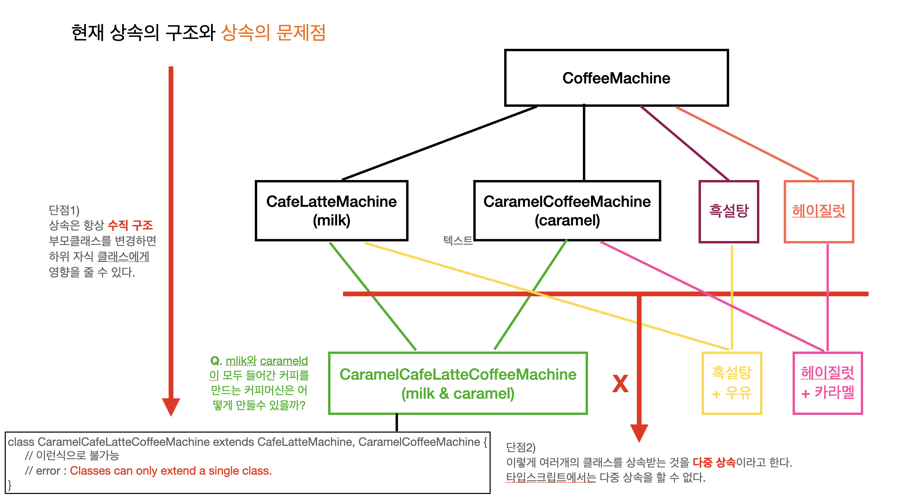

# Inheritance problem

> 상속의 문제점을 다이어그램으로 알아보자. 구조에 대한 소스는 3_6까지 진행되었던 소스코드를 바탕으로 한다.

상속의 문제점

1. 수직 구조로 인한 부모 클래스의 변화가 자식 클래스에 영향을 미칠수 밖에 없다.
2. 다중 상속 불가 : 두 개이상의 부모 클래스를 상속받을 수 없다.

이러한 상속의 문제점들 때문에 `composition`을 사용하는 것을 추천한다.
